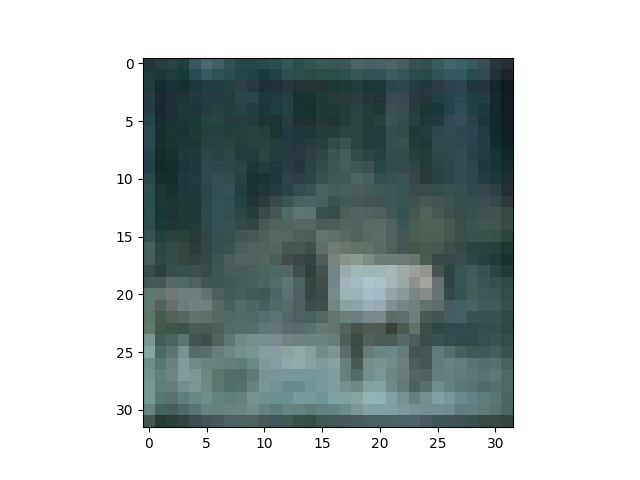
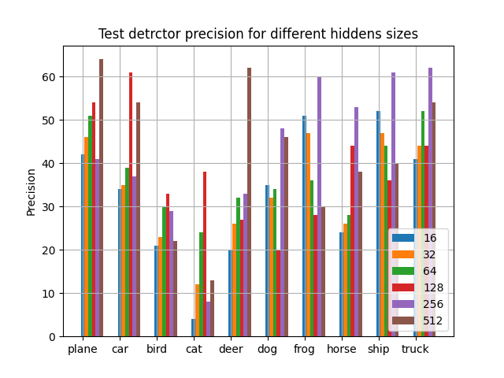

# Детектор изображений из скрытого слоя автоэнкодера

### Задание:

Написать и обучить модель-автокодировщик на датасете на выбор: CIFAR10, CIFAR100.
Обучить модель-классификатор на латентных представлениях обученного автокодировщика.

### Описание эксперимента:

#### Автоэнкодер:

Датасеты CIFAR10 и CIFAR100 аналогичны, разница между заключается в количестве детектируемых классов, Поэтому в своих экспериментах я использовал CIFAR10.

Для автоэнкодера была взята архитектура содержащая Conv2d и MaxPool в начале сети для уменьшения размерности входных параметров, далее 1 полносвязный слой.

Модель Энкодера:

Модель декодера симметрична Енкодеру, но в противоположном порядке.

В качестве hidden layer были рассмотрены 6 значений: [16, 32, 64, 128, 256, 512]

Обучение проходило с использованием MSELoss, оптимезатором Adam и 1e-3 learning step.

Изменение loss для каждого скрытого слоя в зависимости от эпохи представлен ниже

Так же можно посмотреть сравнения изображений для различных скрытых слоев:

	
|  | Image | Autoencoder |
| ---------------|---------------|----------------|
| hidden=16 ||
| hidden=32 ||
| hidden=64 ||
| hidden=128 ||
| hidden=256 ||
| hidden=512 ||

##### Первые выводы:
* Чем больше скрытый слой тем ниже loss и качество изображений становятся более схожими
* Из данного эксперимента, акцентируя внимание на loss можно заметить, что скрытые слои размера 512 и 256 имею несущественные отличия по качеству

#### Детектор изображений:

Детектор изображений обучался на скрытых слоях моделей, которые были исследованы выше.
В качестве детектора изображения использовался 1 полносвязный слой.
Обучалась данная система с использованием NLLLoss и learning rate = 1e-3

График loss функции для различных скрытых слоев:

Точность детектирования на обучающем датасете:

Точность детектирования на тестовом датасете:

Проанализировав графики можно сказать, обучение на скрытых слоях автоэнкодера не может поднять качество выше 50 %

Для этих результатов давайте построим метрику precision:

Для лучших моделей построим матрицы смежности, для анализа детекторов.

Модель обученная на скрытом слое = 256:

[comment]: <> (| | Detected|)
| | plane | car | bird | cat | deer | dog | frog | horse | ship | truck
|---------------|---------------|---------------|---------------|---------------|---------------|---------------|---------------|---------------|---------------|---------------|
|plane|417|20|66|17|22|64|32|66|215|81
car|40|379|18|3|15|49|67|74|81|274|
bird|67|15|296|23|127|133|166|95|53|25|
cat|15|15|93|82|62|362|177|105|33|56|
deer|30|4|128|9|332|136|191|126|24|20|
dog|18|9|85|47|75|481|106|125|32|22|
frog|9|9|61|16|100|104|601|55|19|26|
horse|19|10|55|9|68|135|58|537|27|82|
ship|104|36|28|5|14|53|22|30|615|93|
truck|54|79|11|4|17|23|49|67|70|626|

Здесь по горизонтали представлены реальные метки, а по вертикали, те которые выдал детектор.

#####По данному детектору можно сделать следующие выводы:
* Класс car путается с классом Truck
* Класс cat путается со всеми "животными" классами ('bird', 'deer', 'dog', 'frog', 'horse' )
* Класс plane путается с ship (Это можно обосновать тем что один находиться в синем небе, другой в синем море)

Модель обученная на скрытом слое = 512:

| | plane | car | bird | cat | deer | dog | frog | horse | ship | truck
|---------------|---------------|---------------|---------------|---------------|---------------|---------------|---------------|---------------|---------------|---------------|
plane|640|35|39|11|70|38|8|25|69|65|
car|100|548|12|9|30|41|17|30|26|187|
bird|132|31|227|23|345|122|39|41|13|27|
cat|60|48|73|138|255|282|44|28|13|59|
deer|58|20|84|18|622|93|39|36|10|20|
dog|47|29|65|71|225|460|21|37|18|27|
frog|38|40|58|47|353|95|304|18|15|32|
horse|72|32|36|22|200|149|12|385|9|83|
ship|316|70|17|7|41|44|7|2|402|94|
truck|112|171|9|7|37|33|19|39|28|545|

Здесь по горизонтали представлены реальные метки, а по вертикали, те которые выдал детектор.

#####По данному детектору можно сделать следующие выводы:
* Класс bird путается с классом plane, скорее всего из-за неба, а так же 'deer' и 'dog'
* Класс frog путается с классом deep, скорее всего из-за зеленной зоны
* Класс ship путается с plane, так же как и предыдущий детектор

###Выводы:
* Обучение на скрытых слоях автоэнкодера не может поднять качество выше 50 %
* Проблемными языками для всех систем являются классы ['bird', 'cat']
* Анализируя график precision, системы с разными скрытыми слоями обучиваются под разные классы
* Лучшие рузультаты показали системы с размерами скрытого слоя = [246, 512]
* Многие из классов путаются из-за фона изображения ('ship', 'plane')
* Некоторые классы очень похожи ('car', 'truck')

### Идеи:
* Попробовать повысить сложность модели автоэнкодера и детектора
* Попробовать больший скрытый слой
* Добавление Аугментации

